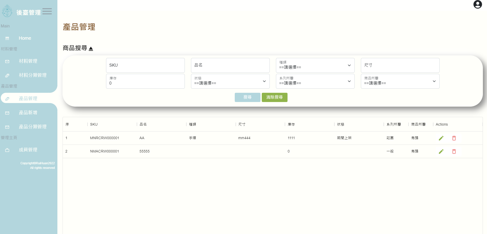
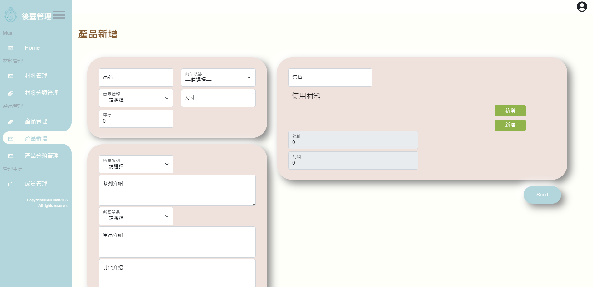
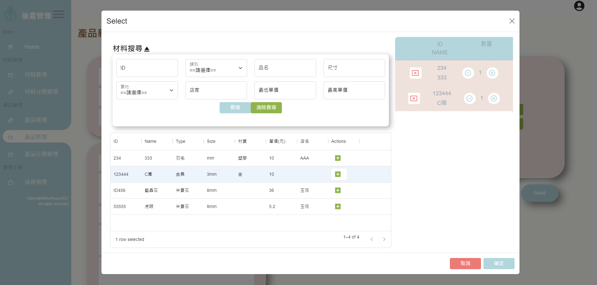

# LTL
dashboard and cart


## Installation

#### frontend

```
cd frontend
npm i
```

#### backend

```
cd backend
npm i
```

## Running the app

#### frontend

```
npm run dev
```

#### backend

```
npm run dev
```

## Open the app

```
http://localhost:3000
```


## Project Technology
- Node.js
- Express.js
- Sequelize
- React.js
- Vite
- axios
- Bootstrap
- TypeScript


## View





